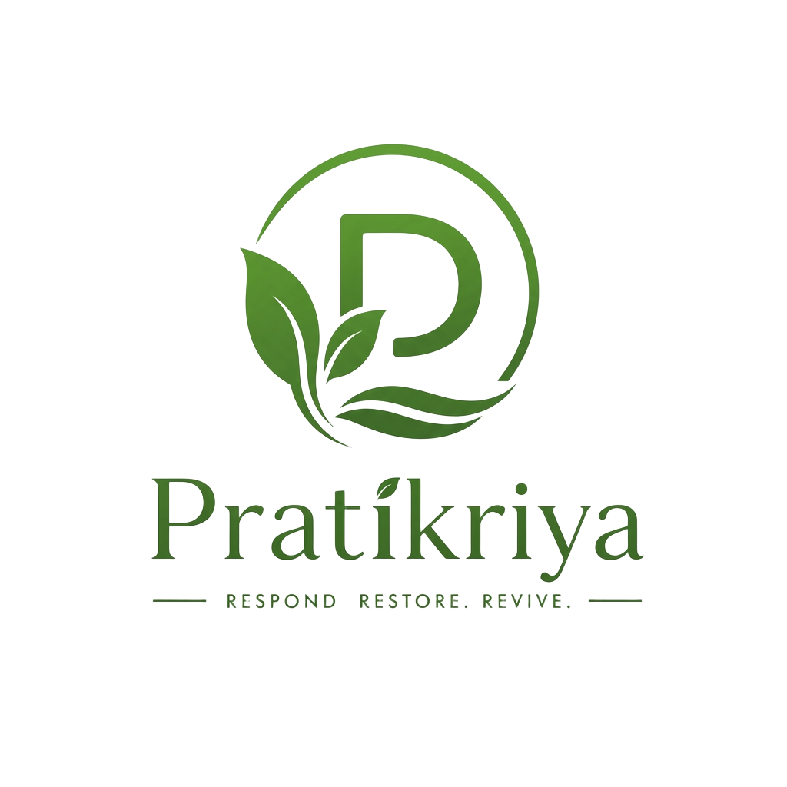

<div align="center">



# Pratikriya AI

### The Cognitive Active Learning Companion

**Respond. Restore. Revive.**

[](https://pratikriya.lovable.app)

[](https://github.com/sri951/pratikriya/actions)
[](https://www.typescriptlang.org/)
[](https://react.dev/)
[](https://supabase.com/)
[](https://pratikriya.lovable.app)
[](LICENSE)

An AI-powered learning platform that doesn't just answer questions — it diagnoses mistakes,
turns notes into study packs, grades handwritten exams, and lets you learn by teaching.

[Features](#-key-features) · [Architecture](#️-system-architecture) · [Setup](#-local-installation--setup) · [Docs](#-documentation) · [Roadmap](#-future-roadmap)

</div>

---

## 🎯 The Problem — Learning Shouldn't Wait

Students frequently hit obstacles while studying independently, yet feedback from instructors or peers takes hours or days. When feedback is delayed:

- ❌ Learning momentum is broken
- ❌ The original train of thought is lost
- ❌ Misconceptions harden into bad habits
- ❌ Students become hesitant to ask "basic" questions

## 💡 The Solution — Instant, Active, Judgment-Free Learning

- ⚡ **Instant, not eventual** — explanations, error diagnostics, and quizzes the second a question or document is submitted
- 🎯 **Personalized to you** — calibrated to confidence, strengths, missing prerequisites, and past mistake history
- ❤️ **Kind by default** — a judgment-free environment that encourages experimentation, teaching, and curiosity

---

## 🌟 Key Features

### 💬 1. AI Tutor — Ask Doubt & Deepen

- Ask questions in natural language with subject categories and tags
- Attach diagrams, homework photos, or equation snapshots (multimodal input)
- Step-by-step markdown breakdowns, Mermaid.js flowcharts, key takeaways, self-check questions
- **Text-to-Speech** spoken summaries and a **Deepen Answer** module to clarify specific steps

### 📚 2. AI Notes Intelligence

Upload PDFs, documents, slides, or handwritten notes and get a full 8-resource study pack:

| Resource | Description |
| :------- | :---------- |
| 📄 3-tier summaries | 5-min recap, 15-min review, full deep-dive |
| 🧠 Smart topic notes | Exam tips and memory hooks |
| 🗂️ Flashcards | 12–30 spaced-repetition cards (SuperMemo/Leitner) |
| ❓ MCQs | 10–50 questions with answer keys and rationale |
| 🗺️ Mindmap | Interactive Mermaid.js diagram |
| 📐 Formula sheet | Symbol meanings and units |
| 📅 Revision plan | Structured 7-day schedule |
| 🔍 Ask My Notes | In-context ELI10 Q&A grounded in your files |

### 📝 3. Exam Mode & OCR Grader

- Generate source-grounded exams by difficulty (Easy / Medium / Hard / Mixed) and topic focus
- Timed interface with multiple-choice and open-ended questions
- AI grading with OCR — type answers or upload photos of handwritten work
- Diagnostics: score dial (/10), accuracy %, per-question breakdown, strengths, mistakes, missing concepts
- **"Generate quiz on weak topics"** one-click remediation

### 🕵️ 4. AI Detective — Mistake Root-Cause Investigation

- Investigates *why* a mistake happened, not just what the right answer is
- **Phase 1 — Intake & Suspects**: analyzes the wrong answer + confidence rating, ranks 3–6 suspect root causes, issues diagnostic probes
- **Phase 2 — Verdict & Concept Tree**: identifies the underlying misconception, renders a concept dependency tree highlighting the missing node, and provides a step-by-step repair checklist
- Mistake timeline, repeat-pattern tracking, and topic error heatmaps

### 🎓 5. Reverse Teacher Mode — Learn by Teaching

- You become the teacher; an AI persona becomes the student (Protégé Effect)
- 5 student personalities: *Curious, Skeptical, Exam-focused, Fast, Novice*
- Multi-modal teaching: text, speech-to-text voice, photo attachments, and an **interactive whiteboard**
- The AI student takes structured notes in real time
- Session report: teaching clarity score, AI understanding gained (10–100%), earned badges, and a thank-you letter from your AI student

### 📊 6. Learning Profile & Analytics

- Unified dashboard aggregating events across all 5 modes
- Level, rank title, XP progress meter, and overall cognitive mastery dial
- Topic Competency Matrix with status filters (*Mastered ≥80%*, *Developing 50–79%*, *Needs Attention <50%*)
- Recurring misconception detection and prioritized revision schedule

---

## 📸 Screenshots

<div align="center">


</div>

---

## 🏗️ System Architecture


<details>
<summary><b>Data flow diagram</b></summary>


</details>

Full details in [docs/ARCHITECTURE.md](docs/ARCHITECTURE.md).

## 🛠️ Technology Stack

| Layer | Stack |
| :---- | :---- |
| **Frontend** | React 19 · TanStack Start (SSR) · TanStack Router & Query · Tailwind CSS 4 · Radix/shadcn UI · Framer Motion |
| **AI & TTS** | Google Gemini 3 Flash · OpenAI TTS · Vercel AI SDK (structured Zod outputs) |
| **Backend & Auth** | Supabase PostgreSQL with Row-Level Security · Supabase Auth (Email + Google OAuth) |
| **Offline / PWA** | vite-plugin-pwa · Workbox caching · IndexedDB (`idb`) |
| **Visualizations** | Mermaid.js · Recharts · HTML5 Canvas whiteboard |
| **Quality** | Vitest · ESLint 9 · Prettier · TypeScript 5.8 strict |

---

## 💻 Local Installation & Setup

**Prerequisites:** Node.js ≥ 20.x, Git

```bash
# 1. Clone
git clone https://github.com/sri951/pratikriya.git
cd pratikriya

# 2. Install
npm install

# 3. Configure environment
cp .env.example .env
```

Fill in `.env`:

```ini
VITE_SUPABASE_URL=https://your-project.supabase.co
VITE_SUPABASE_ANON_KEY=your-anon-key
LOVABLE_API_KEY=your-ai-gateway-key
```

```bash
npm run dev    # dev server with SSR + HMR
npm test       # unit tests
npm run lint   # linter
npm run build  # production build
```

---

## 📂 Project Structure

```text
pratikriya/
├── .github/
│   ├── workflows/             # CI pipeline
│   └── ISSUE_TEMPLATE/        # Bug report & feature request templates
├── docs/                      # Architecture, demo script, contributing, security
├── public/                    # Logo, icons, manifest, robots.txt
├── src/
│   ├── components/            # Shared UI
│   │   ├── notes/             # Notes detail, MCQs, flashcards
│   │   ├── teach/             # Interactive whiteboard canvas
│   │   └── ui/                # shadcn design system
│   ├── hooks/                 # Auth, online status, workflow hooks
│   ├── integrations/          # Supabase client & auth middleware
│   ├── lib/                   # Server functions, schemas, AI gateway
│   │   ├── __tests__/         # Unit tests
│   │   ├── ask.functions.ts       # AI Tutor
│   │   ├── detective.functions.ts # AI Detective
│   │   ├── exam.functions.ts      # Exam Generator & OCR Grader
│   │   ├── notes.functions.ts     # Notes Intelligence
│   │   ├── profile.functions.ts   # Learning Profile
│   │   └── teach.functions.ts     # Reverse Teacher
│   └── routes/                # File-based pages (/, /auth, /exam, /notes, /teach, /detective, /profile)
├── supabase/migrations/       # 7 PostgreSQL migrations with RLS
└── README.md
```

---

## 📚 Documentation

| Guide | Description |
| :---- | :---------- |
| [🏛️ Architecture](docs/ARCHITECTURE.md) | Technical architecture, data lifecycle, security model |
| [🎤 Demo Script](docs/DEMO_SCRIPT.md) | 3-minute pitch and complete live walkthrough |
| [🤝 Contributing](docs/CONTRIBUTING.md) | Development standards, testing, PR workflow |
| [🔒 Security Policy](docs/SECURITY.md) | RLS enforcement, auth model, vulnerability reporting |

---

## 🔮 Future Roadmap

- [ ] **Collaborative Peer Teaching** — multiplayer Reverse Teacher where two students co-teach an AI student
- [ ] **Voice-to-Voice Streaming** — real-time duplex audio conversation with AI student personas
- [ ] **Native Mobile App** — Capacitor / React Native wrappers for iOS and Android
- [ ] **Classroom Dashboard** — group analytics for educators to spot class-wide misconceptions early

---

## 🤝 Contributing

Contributions are welcome! Please read the [Contributing Guidelines](docs/CONTRIBUTING.md) and use the issue templates to report bugs or propose features.

## 📄 License

This project is licensed under the [MIT License](LICENSE).

<div align="center">

**Built with 💚 for every student who ever waited too long for an answer.**

</div>
